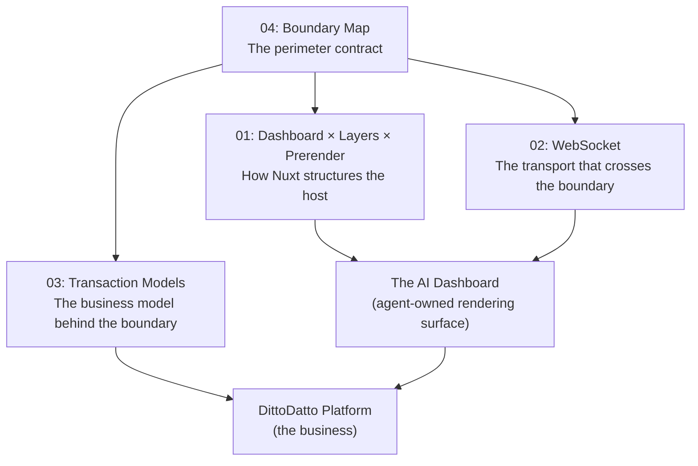

# Synthesis: Where the Astrolab Points

> Executive summary — the convergence of Dashboard, WebSocket, Layers, Prerender, Transactions, and the Agent Boundary.

---

## The Map

Four reports were produced in this session. Here is how they connect:



---

## The Five Findings

### 1. The Boundary Is Clean — Keep It That Way

The A2NUI codebase correctly isolates the rendering engine from any business logic. The `processor.ts` is framework-agnostic. The composable wraps it with Vue reactivity. The components map abstract types to Nuxt UI. Datto never touches any of this — it only speaks A2UI JSONL.

**Action:** No code changes needed. This boundary should be enforced as a design principle in code reviews.

→ Full analysis: [04-boundary-map.md](file:///media/addinator/Mercury/Libraries/Nuxt/A2NUI/A2NUI/.docs/Datto/04-boundary-map.md)

### 2. The Dashboard Is an SPA Shell, Not a Prerendered Page

The AI Dashboard cannot be prerendered because its content is generated at runtime by the agent. But the **shell** (sidebar, header, empty zone placeholders) should be shipped instantly as an SPA. Marketing pages, store profiles, and landing pages should be prerendered or ISR for SEO.

Nuxt Layers become relevant when the Business Portal integration begins — not now. The A2NUI app is too small to benefit from layer extraction today.

**Action:** Add `routeRules: { '/portal/**': { ssr: false } }` when the dashboard route is created. Defer layer extraction.

→ Full analysis: [01-dashboard-layers-prerender.md](file:///media/addinator/Mercury/Libraries/Nuxt/A2NUI/A2NUI/.docs/Datto/01-dashboard-layers-prerender.md)

### 3. WebSocket Is Required for the Dashboard, But Not Yet

The playground uses SSE and that's correct for its request-response pattern. The dashboard requires WebSocket for:

- Server-initiated visual pings (new booking → card slides in)
- Client-to-server events (button clicks, form submissions)
- Long-lived connection with heartbeat

The A2UI processor is transport-agnostic, so switching from SSE to WebSocket is a composable-level change, not an architectural rewrite.

**Action:** Implement WebSocket when dashboard development begins (roadmap Phase 3). Keep SSE for the playground.

→ Full analysis: [02-websocket-applicability.md](file:///media/addinator/Mercury/Libraries/Nuxt/A2NUI/A2NUI/.docs/Datto/02-websocket-applicability.md)

### 4. Hybrid Freemium + Commission Is the Right Transaction Model

Based on Norwegian market dynamics, the "Prøv gratis" positioning, and current enterprise AaaS trends:

- **Free tier** with 4% per-booking commission (adoption driver)
- **Profesjonell** at NOK 399/mo with 2% commission (growth tier)
- **Enterprise** at NOK 999/mo with 1% commission (chains, API access)

Vipps MobilePay split payments should handle fund flow to avoid Finanstilsynet licensing. Billing infrastructure should be event-driven from day one.

**Action:** Define billing event schema in `shared-types`. Implement metering when booking flow is complete. For now, this is a product decision, not an engineering task.

→ Full analysis: [03-transaction-models-enterprise.md](file:///media/addinator/Mercury/Libraries/Nuxt/A2NUI/A2NUI/.docs/Datto/03-transaction-models-enterprise.md)

### 5. A2NUI's Role Is Narrower Than It Appears

A2NUI is not the "AI dashboard." It is the **rendering engine** that the dashboard hosts. The distinction matters:

| Concern                               | Owner                              |
| ------------------------------------- | ---------------------------------- |
| "What should the user see right now?" | **Datto** (the agent)              |
| "How should it look when rendered?"   | **A2NUI** (the renderer)           |
| "Where does it go on screen?"         | **Dashboard component** (the host) |
| "How does the user pay for it?"       | **Platform** (billing)             |
| "How does data flow in real-time?"    | **WebSocket** (the transport)      |

A2NUI is one piece. The dashboard, the agent, the transport, and the billing system are four other pieces. They converge at the boundary, but they are independently developed, tested, and deployed.

---

## The Sequence — What to Build, In What Order

Based on the dependency graph across all four reports:

```
Phase   What                                  Why                                         Blocks
─────   ────────────────────────────────────  ──────────────────────────────────────────  ──────────
  0     Agent Card schema + endpoint          Foundation for A2A discovery                Phase 1
  1     Datto speaks A2A (MercuryEngine)      Existing logic gets an agent mouth          Phase 2, 4
  2     Ditto MVP (intent → action)           The user agent that talks to Datto          Phase 3

  ─── A2NUI WORK STARTS HERE ───

  R1    Renderer hardening (Phase 1 roadmap)  Action handling, data binding, error bounds Dashboard
  R2    Bidirectional comms (Phase 3 roadmap) Client-to-server events, WebSocket          Dashboard
  R3    AI Dashboard component                Zone layout, ping queue, shell              Integration

  ─── INTEGRATION ───

  I1    Dashboard ↔ Datto WebSocket           Connect the renderer to the live agent      Full stack
  I2    Billing events                        Metering infrastructure                     Revenue
  I3    Nuxt Layers extraction                Separate a2ui-core from dashboard           Scale
```

> [!IMPORTANT]
> **A2NUI work (R1-R3) is independent of Datto work (Phase 0-2).** They can run in parallel. The two streams converge at I1 (Dashboard ↔ Datto WebSocket). This is the critical integration point.

---

## What We Don't Know Yet (Open Questions)

| Question                                                                                           | Impact                                    | When to Answer          |
| -------------------------------------------------------------------------------------------------- | ----------------------------------------- | ----------------------- |
| Will MercuryEngine support WebSocket natively, or does Nuxt proxy all WS connections?              | Architecture of I1 integration point      | Before Phase R2         |
| What is the exact A2UI client-to-server event schema? v0.10 spec clarity?                          | Needed for Phase R2 (bidirectional comms) | Read the spec in detail |
| Does Vipps partner API support split payments at the transaction level?                            | Transaction model implementation          | Before billing work     |
| Should the dashboard support offline/cached state when WS disconnects?                             | UX decision, affects composable design    | Before Phase R3         |
| What is the Firebase billing impact of Datto watching multiple Firestore collections per business? | Infrastructure cost                       | Before Phase 0 at scale |

---

## Report Index

| #   | Title                           | Path                                                                                                                                              | Focus                               |
| --- | ------------------------------- | ------------------------------------------------------------------------------------------------------------------------------------------------- | ----------------------------------- |
| 01  | Dashboard × Layers × Prerender  | [01-dashboard-layers-prerender.md](file:///media/addinator/Mercury/Libraries/Nuxt/A2NUI/A2NUI/.docs/Datto/01-dashboard-layers-prerender.md)       | Nuxt architecture for the dashboard |
| 02  | WebSocket Applicability         | [02-websocket-applicability.md](file:///media/addinator/Mercury/Libraries/Nuxt/A2NUI/A2NUI/.docs/Datto/02-websocket-applicability.md)             | Transport analysis                  |
| 03  | Transaction Models (Enterprise) | [03-transaction-models-enterprise.md](file:///media/addinator/Mercury/Libraries/Nuxt/A2NUI/A2NUI/.docs/Datto/03-transaction-models-enterprise.md) | Business model and billing          |
| 04  | Boundary Map                    | [04-boundary-map.md](file:///media/addinator/Mercury/Libraries/Nuxt/A2NUI/A2NUI/.docs/Datto/04-boundary-map.md)                                   | Datto ↔ Nuxt perimeter              |
| 00  | Synthesis (this doc)            | [00-synthesis.md](file:///media/addinator/Mercury/Libraries/Nuxt/A2NUI/A2NUI/.docs/Datto/00-synthesis.md)                                         | Executive summary                   |

---

_Session: 2026-02-13 — Research and analysis, Think-Tank mode. No code changes made._
